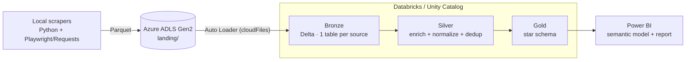

# Talent Market Lens

**An end-to-end data platform for the data & analytics job market: multi-source scraping → Medallion architecture on Databricks → salary, skills and geography analytics in Power BI.**

[](https://www.python.org/)
[](https://spark.apache.org/)
[](https://www.databricks.com/)
[](https://delta.io/)
[](https://powerbi.microsoft.com/)
[](#testing)
[](#license)

> **Status:** v1 — the ELT pipeline, data model and Power BI report are fully working end to end. Future iterations are outlined in the [roadmap](ROADMAP.md).

---

## Why this project

Job postings are an unstructured, multilingual and inconsistent data source: salaries come in a dozen formats, skills are buried in free text, and the same role appears across several portals. **Talent Market Lens turns that raw noise into a clean, queryable star schema** that answers practical questions:

- Which data skills are most in demand, and how does demand change over time?
- What does the market pay by role, seniority and country?
- Where are the jobs, and how is remote/hybrid/on-site distributed?
- How reliable are the data behind each answer?

It is built as a **portfolio-grade data platform**, not a dashboard exercise: reproducible, tested, config-driven and documented.

---

## Highlights

- **Four job portals** ingested through the same Medallion pipeline (Indeed, LinkedIn, InfoJobs and a multi-site merge of IrishJobs, StepStone, Jobs.ch and Glassdoor).
- **Auto Loader** (Databricks) for incremental Bronze ingestion with schema evolution and checkpoints.
- **Columnar PySpark enrichment** (no UDFs): skills extraction, seniority, employment type, role classification, salary parsing and normalization to **annual EUR**, and geographic normalization.
- **Star schema in Gold** consumed directly by Power BI: `fact_offers`, `fact_offer_skills`, `dim_currency`, `dim_skill_list`, `dim_calendar` and a company catalog.
- **Data-quality built in**: every salary is classified (`ok` / `missing` / `unknown_period` / `outlier_review` / `invalid`) and posting dates are flagged for validity.
- **Zero secrets, fully externalized config**: storage account, catalog, schemas and checkpoints are passed as notebook widgets / environment variables — nothing sensitive is versioned.
- **Tested**: unit tests for the pure normalization rules plus Spark integration tests for `enrich()`, `build_fact_offers()`, currency conversion, skills explosion, idempotency and the calendar.

---

## What this project demonstrates

A complete, production-minded data platform built end to end:

- **Data ingestion & ELT** — multi-source scraping into Azure ADLS Gen2, then Auto Loader with schema evolution and checkpoints.
- **Data engineering on Databricks** — Medallion architecture (Bronze / Silver / Gold) on Delta Lake and Unity Catalog, with fully columnar, reproducible PySpark.
- **Analytics engineering** — a clean star schema (`fact_offers`, `fact_offer_skills` and conformed dimensions) with documented business definitions.
- **BI & semantic modeling** — a 17-table, 58-measure Power BI model and a 5-page report built directly on the Gold layer.
- **Software engineering practices** — externalized configuration, zero secrets in the repository, unit + Spark integration tests and clear documentation.

---

## Architecture



**Layer responsibilities**

| Layer | What happens | Technology |
|---|---|---|
| **Ingestion** | Daily scrapers write Parquet to `landing/<source>/`; a trigger file signals the run. | Python, Playwright, PowerShell, AzCopy |
| **Bronze** | Raw data per source, append with audit columns (`_ingest_date`, `_source_file`). | Auto Loader, Delta Lake |
| **Silver** | Column renaming, enrichment (skills, seniority, salary → annual EUR, work mode, geo), de-duplication. | PySpark (columnar), `enrich()` |
| **Gold** | Unified, de-duplicated star schema ready for BI. | PySpark, Delta Lake |
| **Semantic layer** | Star model, DAX measures and a 5-page report. | Power BI (PBIP / PBIR / TMDL) |

---

## Tech stack

`Python` · `PySpark` · `SQL` · `Azure Data Lake Storage Gen2` · `Databricks` · `Delta Lake` · `Unity Catalog` · `Auto Loader` · `Power BI (PBIP / PBIR / TMDL)` · `pytest`

---

## Data model (Gold)

```
                    Dim_Calendar
                        │
                        ▼
Dim_Companies ◄── Fact_Offers ──► Fact_OfferSkills ──► Dim_SkillList
                        │
                        ▼
              Dim_Currency · Dim_Geo · Dim_RegionMap · Dim_Geo_Coords
```

| Table | Purpose |
|---|---|
| `fact_offers` | Offers with title, company, location, date, work mode, annual EUR salary, role, seniority and skills. |
| `fact_offer_skills` | Bridge offer ↔ skill (one row per offer + skill). |
| `dim_currency` | FX rates to normalize salaries into EUR. |
| `dim_skill_list` | Canonical skill catalog with categories. |
| `dim_calendar` | Date dimension (year, quarter, ISO week, day). |
| `companies_complete_catalog` | Consolidated, de-duplicated company catalog. |

The Power BI semantic model exposes **17 tables and 58 measures** across 5 report pages: *Market Pulse*, *Roles & Skills*, *Salary Insights*, *Opportunity Explorer* and *About & Methodology*.

---

## Repository layout

```
talent-market-lens/
├── databricks_notebooks/       # Bronze, Silver (per source) and Gold PySpark notebooks + modules
├── docs/                       # Runbook and data-source contract
├── scrapers-pipeline/          # Local orchestration and upload to ADLS (PowerShell)
├── indeed_jobs_scraper/        # Scraper: Indeed
├── linkedin_jobs_scraper/      # Scraper: LinkedIn
├── infojobs_jobs_scraper/      # Scraper: InfoJobs
├── multi_site_job_scraper/     # Scraper: IrishJobs, StepStone (NL), Jobs.ch, Glassdoor
├── Job_Offers_Dashboard.pbip   # Power BI project (report + semantic model + maps)
├── requirements.txt
└── ROADMAP.md                  # Plans and next versions
```

---

## Getting started

The full reproduction steps (Unity Catalog setup, externalized configuration, run order and Power BI connection) are in **[docs/RUNBOOK.md](docs/RUNBOOK.md)**. The input/output contract per source is documented in **[docs/DATA_SOURCES.md](docs/DATA_SOURCES.md)**.

Quick version:

```powershell
pip install -r requirements.txt        # pyspark + pytest for local work
python -m pytest databricks_notebooks/tests -q
```

Then, on Databricks:

1. Create the catalog and `bronze` / `silver` / `gold` schemas (Unity Catalog).
2. Upload `databricks_notebooks/*.py` to the workspace.
3. Run **Bronze** (pass `storage_account` and the other widgets).
4. Run the four **Silver** notebooks.
5. Run **Gold** and connect `Job_Offers_Dashboard.pbip` to the `gold.*` tables.

> Configuration is externalized: storage account, container, catalog, schemas and checkpoints are parameters (notebook widgets or environment variables). No credentials are stored in the repository.

---

## Testing

```powershell
python -m pytest databricks_notebooks/tests -q
```

- `test_enrich_pure.py` — pure normalization rules (role categories, multilingual work mode, salary periods, numeric parsing, skill catalog).
- `test_integration_spark.py` — Spark integration: `enrich()`, salary annualization and quality flags, `build_fact_offers()`, currency conversion, `build_fact_offer_skills()`, empty-table handling, idempotent re-runs, `dim_calendar()` and `build_gold()`.

**16 tests passing** locally and on CI — pure-rule tests plus Spark integration tests.

---

## Data quality by design

Data quality is treated as a first-class concern, not an afterthought:

- Every salary is classified (`ok` / `missing` / `unknown_period` / `outlier_review` / `invalid`) and normalized to **annual EUR** only when the period is known — values are never guessed.
- Posting dates carry their origin (`posted` vs `scraped`), keeping time-based analysis auditable.
- Skills, seniority, work mode and geography are normalized against canonical catalogs, so four heterogeneous sources stay consistent in the model.
- Coverage and availability are surfaced in the report itself, so every metric is transparent to the consumer.

**Next iterations** are outlined in the [roadmap](ROADMAP.md).

---

## Roadmap

v1 is complete and running end to end. The next iterations focus on operational maturity and broader analytical value — see the [roadmap](ROADMAP.md).

---

## License

MIT — see `LICENSE`.

## Disclaimer

This project is **for educational and portfolio purposes**. Data comes from public job portals; please review each site's terms of service before redistributing any data. **No credentials, tokens or personal data are published**, and any shared dataset is anonymized and reduced.
