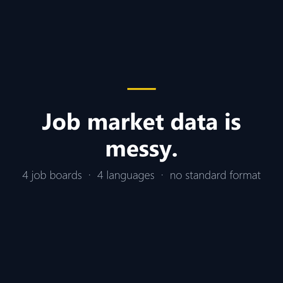
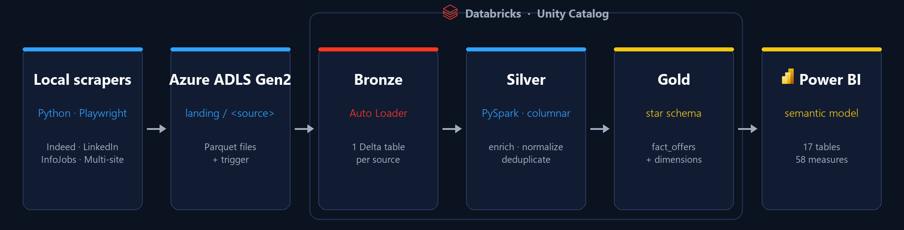
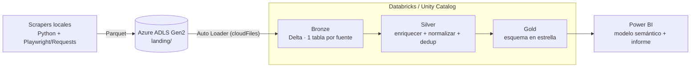
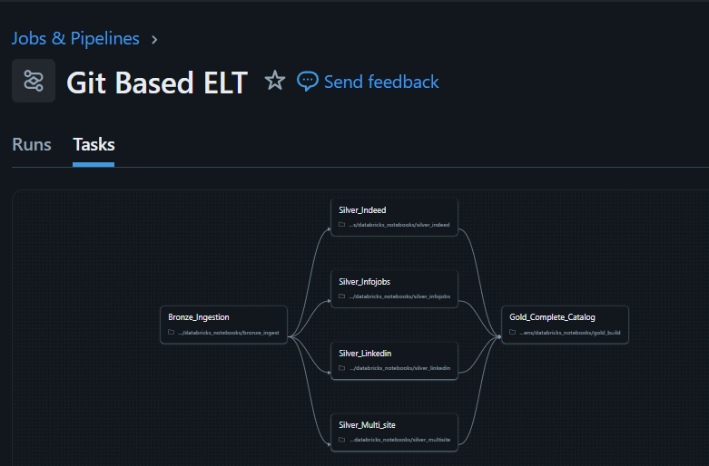
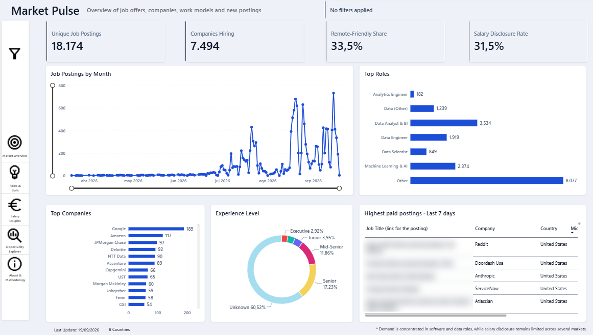
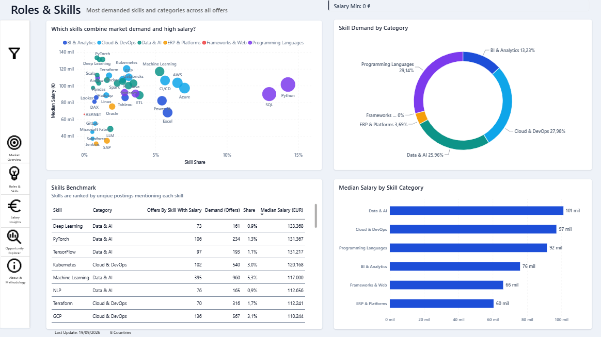
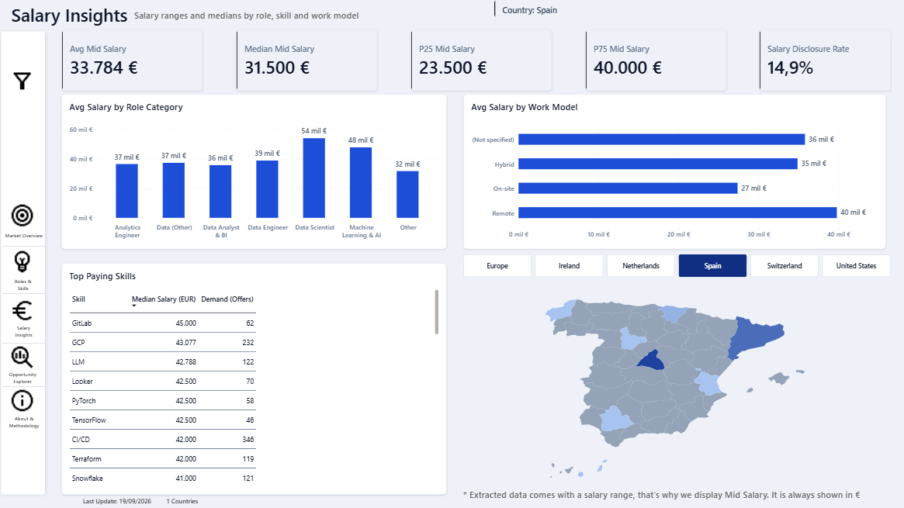
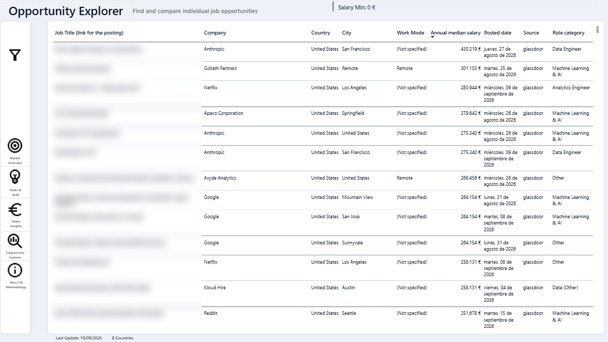
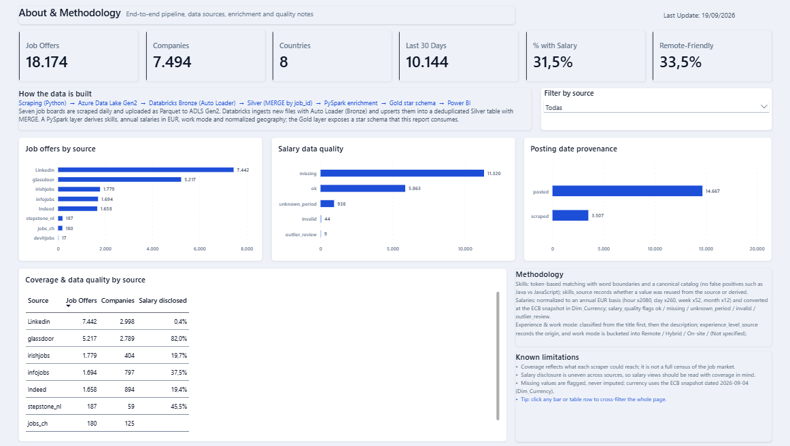
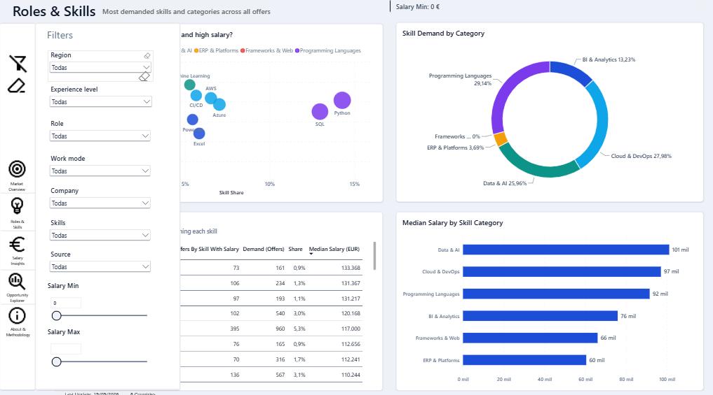

# Talent Market Lens

> [English](../../README.md) · **Español**

**Una plataforma de datos end-to-end para el mercado laboral de datos y analítica: scraping multi-fuente → arquitectura Medallion en Databricks → analítica de salarios, skills y geografía en Power BI.**

[](https://github.com/Darkaleja69)

> Una vista de 10 segundos: de ofertas de empleo desordenadas a datos listos para decidir.

[](https://www.python.org/)
[](https://spark.apache.org/)
[](https://www.databricks.com/)
[](https://delta.io/)
[](https://powerbi.microsoft.com/)
[](#tests)
[](#licencia)

> **Estado:** v1 — el pipeline ELT, el modelo de datos y el informe Power BI funcionan de punta a punta. Las siguientes iteraciones se detallan en el [roadmap](ROADMAP.md).

---

## Arquitectura



Un único flujo reproducible: los scrapers dejan Parquet crudo en Azure ADLS Gen2, Auto Loader lo añade a las tablas Delta de Bronze, PySpark lo normaliza y deduplica en Silver, y Gold expone un esquema en estrella que Power BI consume directamente.



**Responsabilidades por capa**

| Capa | Qué ocurre | Tecnología |
|---|---|---|
| **Ingesta** | Los scrapers diarios escriben Parquet en `landing/<fuente>/`; un fichero trigger señala la ejecución. | Python, Playwright, PowerShell, AzCopy |
| **Bronze** | Datos crudos por fuente, con append y columnas de auditoría (`_ingest_date`, `_source_file`). | Auto Loader, Delta Lake |
| **Silver** | Renombrado de columnas, enriquecimiento (skills, seniority, salario → EUR anual, modalidad, geo) y deduplicación. | PySpark (columnar), `enrich()` |
| **Gold** | Esquema en estrella unificado y deduplicado, listo para BI. | PySpark, Delta Lake |
| **Capa semántica** | Modelo en estrella, medidas DAX y un informe de 5 páginas. | Power BI (PBIP / PBIR / TMDL) |

---

## Por qué este proyecto

Las ofertas de empleo son una fuente de datos no estructurada, multilingüe e inconsistente: los salarios llegan en una docena de formatos, las skills están enterradas en texto libre y el mismo puesto aparece en varios portales. **Talent Market Lens convierte ese ruido en un esquema en estrella limpio y consultable** que responde a preguntas prácticas:

- ¿Qué skills de datos tienen más demanda y cómo evoluciona esa demanda en el tiempo?
- ¿Cuánto paga el mercado según rol, seniority y país?
- ¿Dónde están los empleos y cómo se reparte remoto/híbrido/presencial?
- ¿Qué fiabilidad tienen los datos detrás de cada respuesta?

Está construido como una **plataforma de datos de nivel portfolio**, no como un ejercicio de dashboard: reproducible, testeada, guiada por configuración y documentada.

---

## Puntos destacados

- **Cuatro portales de empleo** ingeridos por el mismo pipeline Medallion (Indeed, LinkedIn, InfoJobs y una fusión multi-site de IrishJobs, StepStone, Jobs.ch y Glassdoor).
- **Auto Loader** (Databricks) para la ingesta incremental en Bronze con evolución de esquema y checkpoints.
- **Enriquecimiento PySpark columnar** (sin UDFs): extracción de skills, seniority, tipo de empleo, clasificación de rol, parseo de salario y normalización a **EUR anual**, y normalización geográfica.
- **Esquema en estrella en Gold** consumido directamente por Power BI: `fact_offers`, `fact_offer_skills`, `dim_currency`, `dim_skill_list`, `dim_calendar` y un catálogo de empresas.
- **Calidad de datos integrada**: cada salario se clasifica (`ok` / `missing` / `unknown_period` / `outlier_review` / `invalid`) y las fechas de publicación se marcan por validez.
- **Cero secretos y configuración totalmente externalizada**: cuenta de almacenamiento, catálogo, esquemas y checkpoints se pasan como widgets de notebook / variables de entorno — nada sensible se versiona.
- **Testeado**: tests unitarios de las reglas puras de normalización más tests de integración con Spark para `enrich()`, `build_fact_offers()`, conversión de divisas, explosión de skills, idempotencia y el calendario.

---

## Qué demuestra este proyecto

Una plataforma de datos completa y con mentalidad de producción, construida de punta a punta:

- **Ingesta y ELT** — scraping multi-fuente a Azure ADLS Gen2 y después Auto Loader con evolución de esquema y checkpoints.
- **Ingeniería de datos en Databricks** — arquitectura Medallion (Bronze / Silver / Gold) sobre Delta Lake y Unity Catalog, con PySpark totalmente columnar y reproducible.
- **Ingeniería analítica** — un esquema en estrella limpio (`fact_offers`, `fact_offer_skills` y dimensiones conformadas) con definiciones de negocio documentadas.
- **BI y modelado semántico** — un modelo Power BI de 17 tablas y 58 medidas, y un informe de 5 páginas construido directamente sobre la capa Gold.
- **Buenas prácticas de ingeniería de software** — configuración externalizada, cero secretos en el repositorio, tests unitarios + de integración con Spark y documentación clara.

---

## Capturas de pantalla

### Databricks — job ELT basado en Git con linaje de notebooks



Toda la plataforma se ejecuta como un único **grafo de dependencias**: `Bronze_Ingestion` se ramifica hacia los cuatro notebooks Silver por fuente (`Silver_Indeed`, `Silver_InfoJobs`, `Silver_LinkedIn`, `Silver_Multi_site`), que confluyen en `Gold_Complete_Catalog`. Cada tarea es un notebook commiteado a Git, así que el pipeline está versionado, es revisable y reproducible en lugar de click-ops.

### Informe Power BI

El informe se compone de cinco páginas analíticas más un panel global de filtros, todas consumiendo directamente el esquema en estrella de Gold.

#### Market Pulse



La vista ejecutiva: KPIs principales (**ofertas únicas**, **empresas contratando**, **porcentaje de empleo remoto** y **tasa de publicación de salario**), la **evolución mensual del volumen de ofertas**, los **roles** y **empresas** con más demanda, el desglose por **nivel de experiencia** y una tabla con las **ofertas mejor pagadas de los últimos 7 días**. *(Los títulos de las ofertas están difuminados intencionadamente por privacidad.)*

#### Roles & Skills



Donde se cruzan demanda y salario. Un **gráfico de burbujas de demanda vs. salario** sitúa cada skill por cuota de mercado (x) frente a su salario mediano (y), coloreado por categoría, para detectar de un vistazo las skills que combinan alta demanda *y* alto salario. Se complementa con un **donut de demanda de skills por categoría**, una tabla **Skills Benchmark** (ofertas, demanda, cuota, salario mediano) y el **salario mediano por categoría de skill**.

#### Salary Insights



Análisis salarial con contexto de país: una fila de KPIs (**salario medio, mediano, P25 y P75**, más la **tasa de publicación de salario**) sobre el **salario medio por categoría de rol** y **por modalidad de trabajo** (remoto / híbrido / presencial / sin especificar). La tabla **Top Paying Skills** y un **selector de país con mapa** completan la vista geográfica y por skill.

#### Opportunity Explorer



La capa de detalle: una lista consultable de **ofertas individuales** con empresa, país, ciudad, modalidad, categoría de rol, salario mediano anual, fecha de publicación y fuente, filtrable por **salario mínimo**. *(Los títulos están difuminados intencionadamente por privacidad.)*

#### About & Methodology



Transparencia dentro del propio informe: frescura de los datos, la traza del pipeline (**"how the data is built"**: scraping → ADLS Gen2 → Bronze → Silver → Gold → Power BI), **ofertas por fuente**, **flags de calidad del salario**, **procedencia de la fecha de publicación** (`posted` vs `scraped`), una **tabla de cobertura por fuente** y la **metodología y limitaciones conocidas** documentadas.

#### Panel global de filtros



Un único panel de segmentadores gobierna todo el informe — **región, nivel de experiencia, rol, modalidad, empresa, skills, fuente y rango salarial** — para segmentar cualquier pregunta de forma coherente en todas las páginas.

---

## Stack tecnológico

`Python` · `PySpark` · `SQL` · `Azure Data Lake Storage Gen2` · `Databricks` · `Delta Lake` · `Unity Catalog` · `Auto Loader` · `Power BI (PBIP / PBIR / TMDL)` · `pytest`

---

## Modelo de datos (Gold)

```
                    Dim_Calendar
                        │
                        ▼
Dim_Companies ◄── Fact_Offers ──► Fact_OfferSkills ──► Dim_SkillList
                        │
                        ▼
              Dim_Currency · Dim_Geo · Dim_RegionMap · Dim_Geo_Coords
```

| Tabla | Propósito |
|---|---|
| `fact_offers` | Ofertas con título, empresa, ubicación, fecha, modalidad, salario anual en EUR, rol, seniority y skills. |
| `fact_offer_skills` | Puente oferta ↔ skill (una fila por oferta + skill). |
| `dim_currency` | Tipos de cambio para normalizar los salarios a EUR. |
| `dim_skill_list` | Catálogo canónico de skills con categorías. |
| `dim_calendar` | Dimensión de fecha (año, trimestre, semana ISO, día). |
| `companies_complete_catalog` | Catálogo de empresas consolidado y deduplicado. |

El modelo semántico de Power BI expone **17 tablas y 58 medidas** en 5 páginas de informe: *Market Pulse*, *Roles & Skills*, *Salary Insights*, *Opportunity Explorer* y *About & Methodology*.

---

## Estructura del repositorio

```
talent-market-lens/
├── databricks_notebooks/       # Notebooks y módulos PySpark de Bronze, Silver (por fuente) y Gold
├── docs/                       # Runbook, contrato de fuentes y capturas (docs/images/)
├── scrapers-pipeline/          # Orquestación local y subida a ADLS (PowerShell)
├── indeed_jobs_scraper/        # Scraper: Indeed
├── linkedin_jobs_scraper/      # Scraper: LinkedIn
├── infojobs_jobs_scraper/      # Scraper: InfoJobs
├── multi_site_job_scraper/     # Scraper: IrishJobs, StepStone (NL), Jobs.ch, Glassdoor
├── Job_Offers_Dashboard.pbip   # Proyecto Power BI (informe + modelo semántico + mapas)
├── requirements.txt
└── ROADMAP.md                  # Planes y próximas versiones
```

---

## Puesta en marcha

Los pasos completos de reproducción (configuración de Unity Catalog, configuración externalizada, orden de ejecución y conexión con Power BI) están en **[docs/es/RUNBOOK.md](RUNBOOK.md)**. El contrato de entrada/salida por fuente está documentado en **[docs/es/FUENTES.md](FUENTES.md)**.

Versión rápida:

```powershell
pip install -r requirements.txt        # pyspark + pytest para trabajo local
python -m pytest databricks_notebooks/tests -q
```

Después, en Databricks:

1. Crea el catálogo y los esquemas `bronze` / `silver` / `gold` (Unity Catalog).
2. Sube `databricks_notebooks/*.py` al workspace.
3. Ejecuta **Bronze** (pasa `storage_account` y el resto de widgets).
4. Ejecuta los cuatro notebooks **Silver**.
5. Ejecuta **Gold** y conecta `Job_Offers_Dashboard.pbip` a las tablas `gold.*`.

> La configuración está externalizada: cuenta de almacenamiento, contenedor, catálogo, esquemas y checkpoints son parámetros (widgets de notebook o variables de entorno). No se almacenan credenciales en el repositorio.

---

## Tests

```powershell
python -m pytest databricks_notebooks/tests -q
```

- `test_enrich_pure.py` — reglas puras de normalización (categorías de rol, modalidad multilingüe, periodos salariales, parseo numérico, catálogo de skills).
- `test_integration_spark.py` — integración con Spark: `enrich()`, anualización de salarios y flags de calidad, `build_fact_offers()`, conversión de divisas, `build_fact_offer_skills()`, manejo de tablas vacías, reejecuciones idempotentes, `dim_calendar()` y `build_gold()`.

**16 tests en verde** en local y en CI — tests de reglas puras más tests de integración con Spark.

---

## Calidad de datos por diseño

La calidad de datos se trata como una preocupación de primer nivel, no como algo accesorio:

- Cada salario se clasifica (`ok` / `missing` / `unknown_period` / `outlier_review` / `invalid`) y se normaliza a **EUR anual** solo cuando el periodo es conocido — los valores nunca se inventan.
- Las fechas de publicación conservan su origen (`posted` vs `scraped`), manteniendo auditable el análisis temporal.
- Skills, seniority, modalidad y geografía se normalizan contra catálogos canónicos, de modo que cuatro fuentes heterogéneas se mantienen consistentes en el modelo.
- La cobertura y la disponibilidad se exponen en el propio informe, para que cada métrica sea transparente para quien la consume.

**Las siguientes iteraciones** se describen en el [roadmap](ROADMAP.md).

---

## Decisiones clave de ingeniería

Las decisiones que con más probabilidad te preguntarán en una entrevista o revisión:

**¿Por qué Auto Loader?**
Ingesta incremental de ficheros sin gestionar el estado a mano: descubre los nuevos Parquet según llegan, evoluciona el esquema automáticamente (`mergeSchema`) y mantiene checkpoints, de modo que cada ejecución solo procesa lo nuevo. Sustituye la lógica frágil de "listar la carpeta y comparar" y escala a landings grandes.

**¿Por qué Delta Lake?**
Transacciones ACID, enforcement y evolución de esquema y time travel sobre almacenamiento de objetos barato. Las escrituras son fiables, las lecturas consistentes y `MERGE` permite actualizaciones idempotentes en lugar de appends a ciegas.

**¿Por qué la arquitectura Medallion?**
Separación de responsabilidades. Bronze conserva el dato crudo y auditable; Silver contiene registros tipados, normalizados y deduplicados; Gold expone tablas listas para negocio. Cada capa se puede reejecutar y testear por separado, y un error de enriquecimiento nunca cuesta el dato original.

**¿Por qué un esquema en estrella en Gold?**
BI y DAX están hechos para ello: una tabla de hechos central con dimensiones conformadas da relaciones simples, agregaciones rápidas y un modelo que un no ingeniero puede leer, en lugar de una tabla ancha y desnormalizada difícil de extender.

**¿Por qué PySpark en lugar de pandas?**
El volumen no cabe cómodamente en la memoria de una máquina y las transformaciones deben correr en Databricks, no solo en local. PySpark columnar (sin UDFs) paraleliza el trabajo y las mismas funciones están cubiertas por tests unitarios y de integración con Spark.

**¿Cómo se consigue la idempotencia?**
Cada capa es determinista: las claves de negocio definen la deduplicación y `MERGE` / sobrescritura por partición hacen que una reejecución converja al mismo estado. Volver a ejecutar los notebooks no duplica filas; los tests de integración lo verifican explícitamente.

**¿Cómo se gestiona la calidad de los datos?**
La calidad se modela, no se espera. Cada salario se clasifica (`ok` / `missing` / `unknown_period` / `outlier_review` / `invalid`) y solo se normaliza a EUR anual cuando el periodo es conocido; las fechas conservan su procedencia (`posted` vs `scraped`); y skills, seniority, modalidad y geografía se mapean a catálogos canónicos. La cobertura y la frescura se exponen en el informe, así que cada métrica es auditable.

---

## Qué haría después

La v1 es deliberadamente la **plataforma de datos**, no el producto final: la ingesta, el pipeline Medallion y el esquema en estrella son la base sobre la que se construyen las siguientes capas. La siguiente iteración es **ML aplicado**: una capa de recomendación y matching de ofertas construida sobre el modelo Gold y entregada con un **ciclo de vida MLOps** completo.

- **Features desde Gold** — skills, rol, seniority, banda salarial, geografía y señales de demanda como features reutilizables y testeadas.
- **Modelo de ranking / matching** — recomendaciones explicables candidato ↔ oferta, con evaluación más allá de la accuracy.
- **Ciclo de vida MLOps** — tracking de experimentos, registro de modelos, scoring por lotes programado y monitorización de drift y calidad.
- **Servido** — recomendaciones puntuadas expuestas de vuelta a través de la capa semántica.

La madurez operativa (carga incremental, monitorización, contratos de esquema) continúa en paralelo — ver el [roadmap](ROADMAP.md).

---

## Roadmap

v1 está completo y funcionando de punta a punta. Las próximas iteraciones se centran en madurez operativa y en un mayor valor analítico — ver el [roadmap](ROADMAP.md).

---

## Licencia

MIT — ver `LICENSE`.

## Aviso

Este proyecto es **para fines educativos y de portfolio**. Los datos provienen de portales de empleo públicos; revisa las condiciones de uso de cada sitio antes de redistribuir cualquier dato. **No se publican credenciales, tokens ni datos personales**, y cualquier dataset compartido está anonimizado y reducido.
